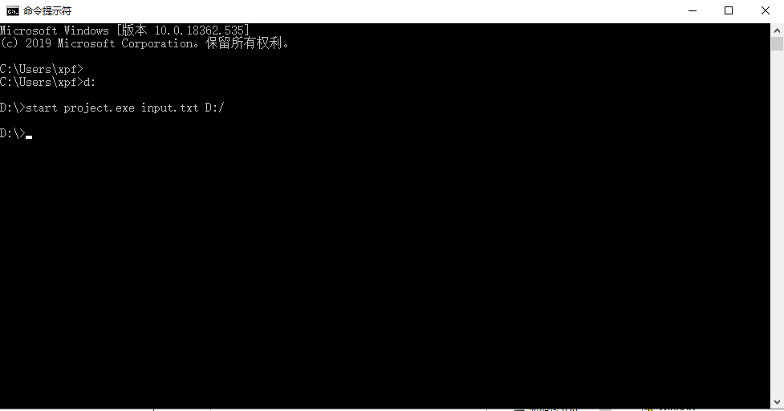
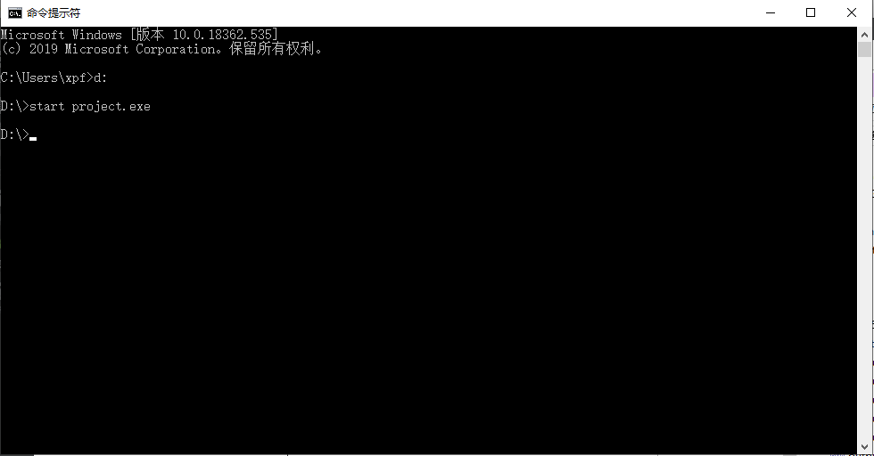
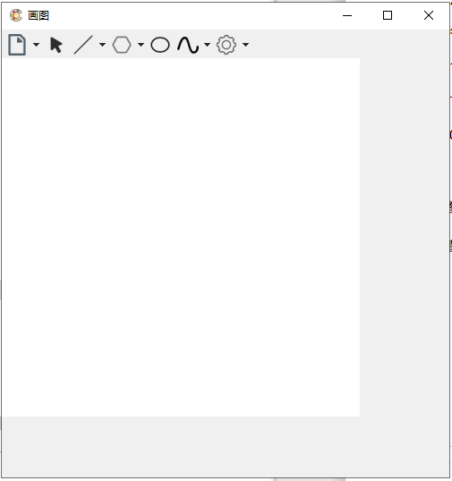
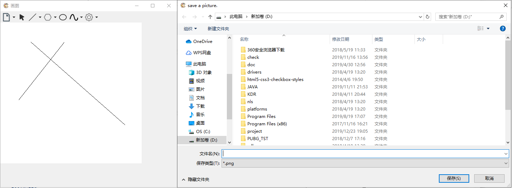

# 开发环境

Window 10、Qt Creator 4.4.1

# 代码编译

编译器：Microsoft Visual C++ Compiler 15.0 (amd64)

Qt 版本：Qt 5.9.2 MSVC2017 64bit

# 程序运行说明

Windows下使用CMD打开程序，程序有两种打开方式，当打开程序并在程序后面添加两个参数(指令序列文件路径和图像保存路径)时，程序执行文件输入操作。以下图为例，input.txt为指令序列文件(需与project.exe处于同一目录下)，D:/为图像保存路径。

​																	图1：有参数打开程序

当无参数打开程序时，如图2

​														 			图2：无参数打开程序

程序执行用户交互功能，显示UI界面，UI界面如图三。

​														 			图3：程序UI界面

左上角显示程序logo与标题，顶端一栏为工具栏，工具栏从左往右依次为文件操作、选择、直线(生成算法可选择DDA或Bresenham，默认为DDA)、多边形(与直线同)、椭圆、曲线和设置(改变画笔颜色、画笔粗细以及清空画布)。

#### 文件操作

##### 保存图片

点击文件标志右侧下拉三角，选择save，弹出保存图片弹窗

​														 					图4：图片保存

默认保存路径为D:\，输入文件名后点击保存即可，保存类型有.png、.jpg和.bmp可供选择。

##### 打开图片

点击文件标志右侧下拉三角，选择open，弹出打开图片弹窗

​														 					图5：图片打开

默认打开路径为D:\，选择一个图片文件打开即可，打开后图片呈现在画布上，但无法进行操作，仅供显示，任意操作会使图片消失。

​														 			图6：一个图片打开的例子

#### 直线

点击工具栏第三项直线图标切换至画直线状态，默认生成算法为DDA，可以点击下拉三角选择生成算法，有DDA和Bresenham。直接在下拉三角中选择生成算法也会切换至画直线状态。

画直线时，首先鼠标在画布上任一点按下左键，不松开时，会以按下的点与鼠标当前点为端点生成实时直线，松开鼠标直线固定。

​							 图7：一个画直线的例子(上方直线为DDA生成，下方直线为Bresenham生成)

#### 多边形

点击工具栏第四项多边形图标切换至换多边形状态，默认生成算法为DDA，可以点击下拉三角选择生成算法，有DDA和Bresenham。直接在下拉三角中选择生成算法也会切换至画多边形状态。

画多边形时，每次在画布上点击鼠标左键并松开则确定多边形的一个顶点，绘制多边形时，确定的第一个点和最后一个点都与当前鼠标所在点生成实时直线，双击鼠标则确定多边形最后一点，绘制完成。

​						图8：一个画多边形的例子(上方多边形为DDA生成，下方多边形为Bresenham生成)

#### 椭圆

点击工具栏第五项椭圆图标切换至画椭圆状态，使用中点椭圆生成算法。

画椭圆时，在画布上任一点按下鼠标左键不放，鼠标移动时实时展示当前椭圆形状，椭圆与由鼠标按下的第一个点和鼠标移动时的实时点所确定的矩形相切，鼠标松开后椭圆固定。

​																	图9：一个画椭圆的例子

#### 曲线

点击工具栏第六项曲线图标切换至换曲线状态，默认生成算法为Bezier，可以点击下拉三角选择生成算法，有Bezier和B-spline。直接在下拉三角中选择生成算法也会切换至画曲线状态。

画曲线时，每次在画布上点击鼠标左键并松开则确定曲线的一个控制点，如图10所示，图中画布上每个黑色小点即为当前确定的控制点。

​															图10：一个画曲线过程的例子

双击鼠标则确定最后一个控制点，画布上控制点消失，仅显示画出的曲线。

​								图11：一个画曲线的例子(上方曲线为Bezier生成，下方曲线为B-spline生成)

#### 调整画布大小

当鼠标移动至画布下边界、右边界以及右下角附近时，鼠标样式分别改变为“↕”、“↔”以及斜拉箭头，此时按下鼠标左键并移动会使画布大小产生变化，但画布上的图形并不会改变大小。

例如

​																			图12-1：调整画布前

​																			图12-2：纵向调整画布

​																			图12-3：横向调整画布

​																			图12-4：斜向调整画布

#### 设置

##### 改变画笔颜色

点击工具栏第七项齿轮图标右侧的下拉三角，选择color项，弹出选择画笔颜色窗口。

​																		图13-1：选择颜色

可以直接点击已有色块改变画笔颜色，也可以自己设置参数值，点击OK完成画笔颜色修改。

​														图13-2：一个画笔颜色修改后的例子

##### 改变画笔粗细

点击工具栏第七项齿轮图标右侧的下拉三角，选择width项，弹出修改画笔粗细窗口。

​																		图14-1：改变粗细

画笔粗细默认为1，最小值为1，最大值为10，拖动蓝色按键即可改变画笔粗细，每拖动一格则画笔粗细的值改变1。

​													图14-2：一个画笔粗细改变后的例子(粗细为2)

##### 清空画布

点击工具栏第七项齿轮图标右侧的下拉三角，选择clear项，重置画布，将画布置为初始状态。

​																				图15：画布清空

#### 对图元操作

##### 选择

点击点击工具栏第二项鼠标图标，切换至选择图元状态。在画布任一图元轨迹附近点击鼠标左键即可选中图元，当鼠标点击在两图元交点处时，优先选择后画的图元。

​										图16：一个选中图元的例子(鼠标点击在直线与椭圆的上交点)

##### 移动

在图元选择的基础上(即与选中一个图元同理，需点击在图元轨迹附近，而非点击在选中框中任意位置)，若鼠标不松开，则图元会根据鼠标位置实时移动，鼠标松开后移动结束，图元固定。

​																	图17：一个图元移动的例子

##### 缩放

选中一个图元出现选中框后，四个端点处均有一个小矩形，将鼠标移动至小矩形附近，鼠标样式改变为对应方向的斜拉箭头，按下鼠标左键并移动，图元会实时等比例缩放，松开鼠标后图元固定。

​							图18：一个图元缩放的例子(按住图元左上角缩放，即选中框右下角固定)

##### 旋转

选中一个图元出现选中框后，框上方有一个旋转图标，将鼠标移动至旋转图标附近，鼠标样式改变为张开手型，按下鼠标左键并移动，鼠标样式变为关闭手型，图元实时旋转，松开后图元固定。当椭圆旋转时，粗细为1的情况下会出现略微锯齿，当粗细为2及以上时锯齿状况减弱或不会出现。

​									图19-1：一个图元旋转的例子(粗细为1的椭圆旋转后出现轻微锯齿)

​									图19-1：一个图元旋转的例子(粗细为2的椭圆旋转后几乎无锯齿)

